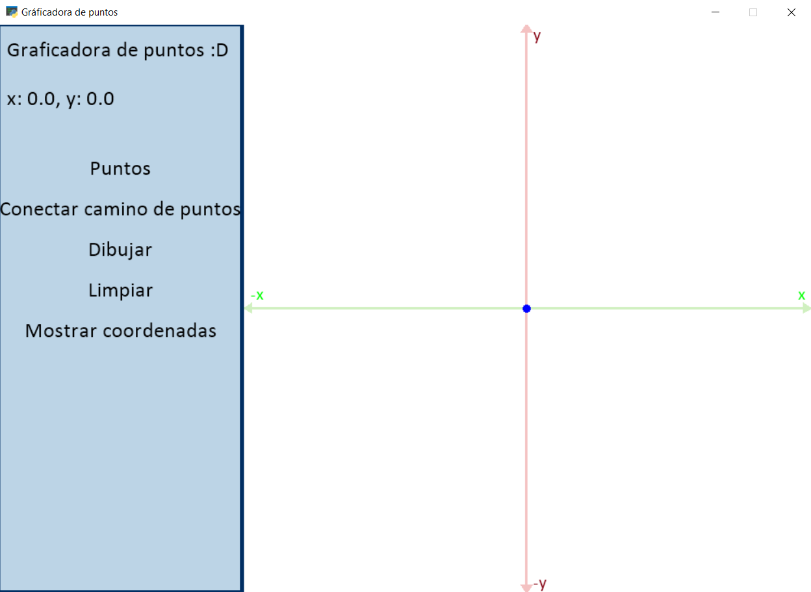
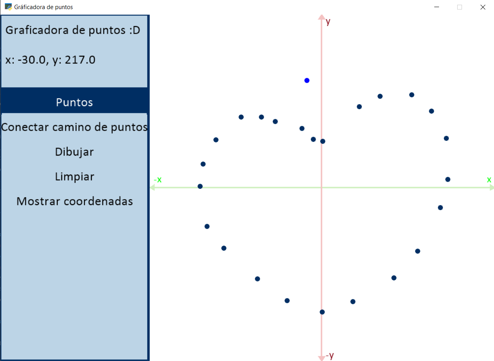
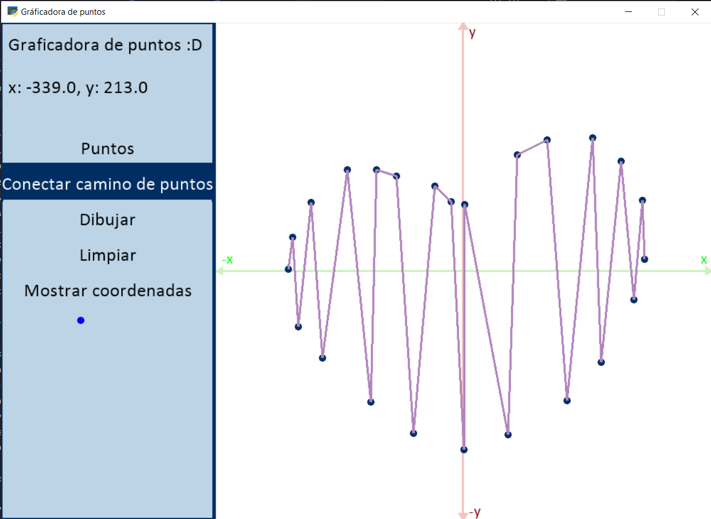
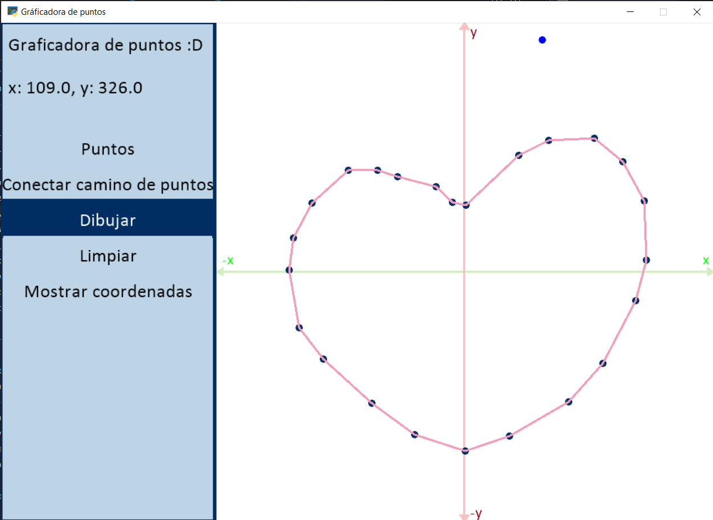
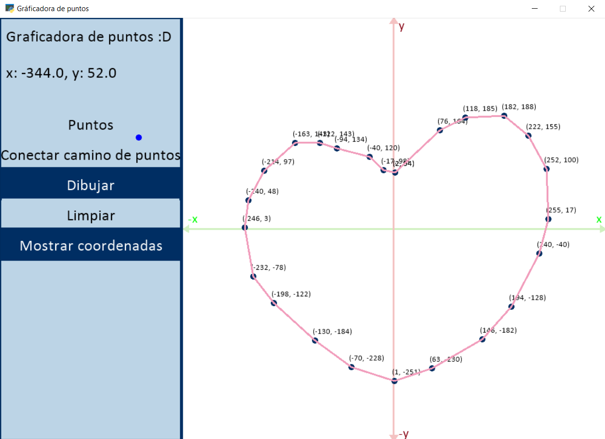
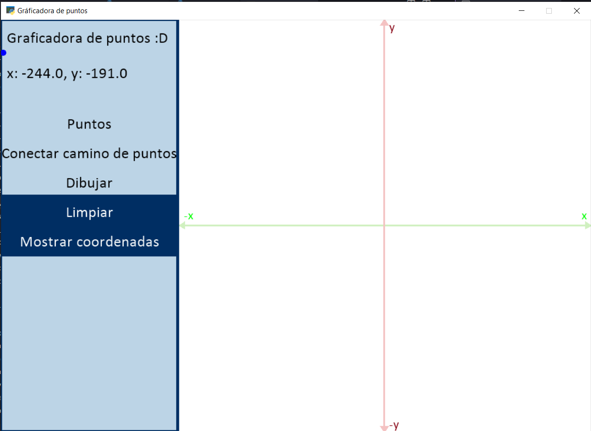

# **Primer parcial Infografia II/2023 - Graficadora de puntos**

## **Datos del Estudiante**
**Nombre:** Ambar Monica Rojas Morales

**Carrera:** Ingeniería de Sistemas Computacionales

**Código:** 61375 

## **Descripción**
El proyecto consta de ser una graficadora de puntos donde puede dibujar varias figuras conforme usted añada puntos en el plano cartesiano.

A su vez, puede ver los dibujos que crea y como se ve el camino seguido de todos los puntos.

## **Ejecución del Proyecto**
1. Verifique tener la versión de Python 3.10 para arriba
2. Clone el repositorio
3. Ejecute el archivo ``main.py``
## **Características**
El proyecto contiene:
* Un menu en la parte izquierda de la pantalla
* El plano cartesiano que va de -350 a 350 tanto en los planos x,y
* El puntero va pintado con un círculo azul para indicar donde pintaria los puntos, o a que opción del menú va a seleccionar

### Menu
El menu contiene:
* **Puntos:** permite dibujar los puntos en el plano cartesiano
* **Conectar camino de puntos:** genera una visualización sobre como se conectan los puntos en el plano cartesiano
* **Dibujar:** permite ver como se ve el gráfico que genera los puntos que estan en el plano cartesiano
* **Limpiar:** elimina todos los puntos escritos
* **Mostrar coordenadas:** da la opción de mostrar las coordenadas de los puntos o no

## **Visualización**
### Pantalla inicial

### Agregar puntos

### Conectar camino de puntos

### Dibujar

### Mostrar coordenadas

### Limpiar

